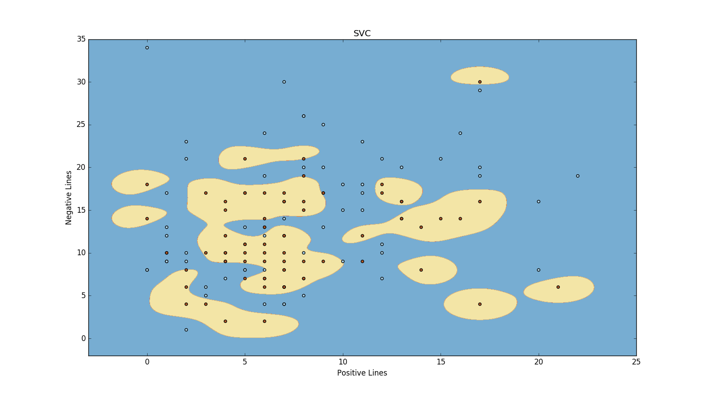
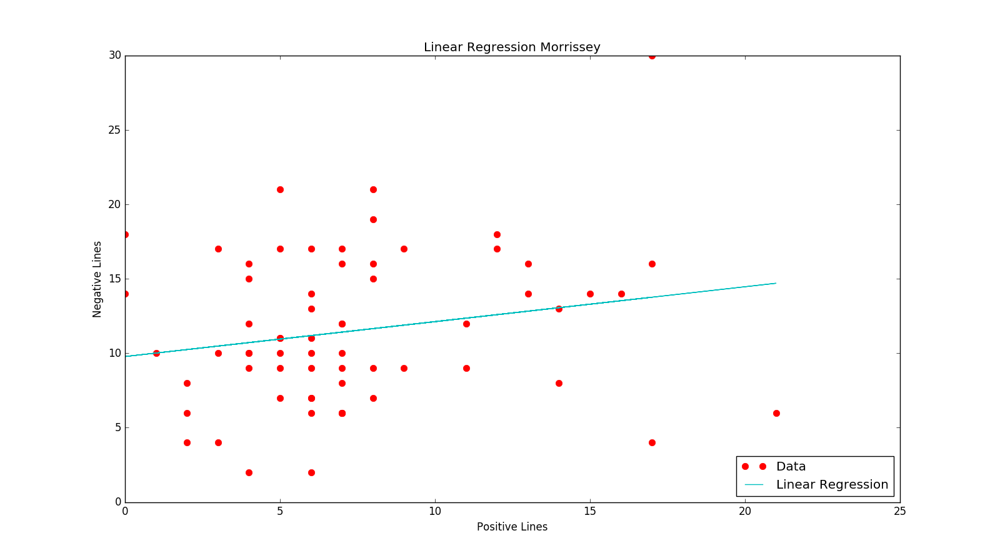
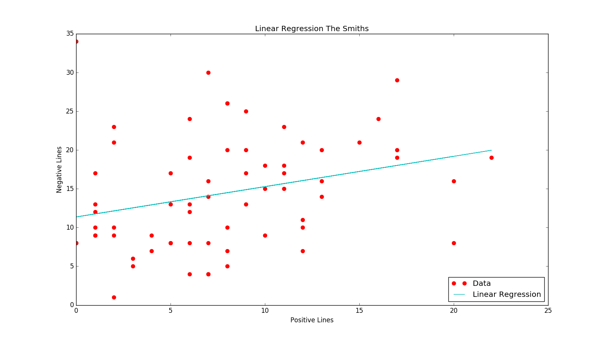

# Classification with Sentiment Analysis of Song Lyrics of Morrissey and The Smiths
Inanc Gurkan, 2016

# Formatting Lyrics
Lyrics used that can't be uploaded here because of the licencing issues. Yet it is possible to adapt to any format with corresponding parsing. Lyrics was parsed to a list of strings.

## Libraries and functions used

#### In data preparation step;
* json
* requests
* glob
* http://text-processing.com/api/sentiment/ API for analysing lyrics line by line.

#### In the data analysis step;
* sklearn.svm
* sklearn.preprocessing
* numpy
* matplotlib.pyplot
* sklearn.linear_model.LinearRegression

## Methods
#### Data Preparation
Lyrics are gathered and formatted as follows
`[result,positive,negative,neutral]`
##### Formatting Songs
The songs are formatted as `[positive,negative,neutral]` for better usability
##### Sampling
n samples were treated (where n is [5,10,15]) as test set, and the rest as the training set.
##### Logging
A logging mechanism created to automate the testing process
##### Preprocessing
Two preprocessing methods used; *scale* and *normalize*.
#### Data Analysis
##### SVM Methods
Two different SVM methods used; SVC and LinearSVC
##### Formatting Songs for Grid 
To plot the graphs in 2D, the data is reduced to 2D in this function

## Test Results
Here are the results for tests. As format : Without Preprocessing, Scaled, Normalized(1d), Normalized(2d)
### SVC Results
##### Sample Count = 5, Test Count = 500, Length of Arrays = 66
| Method 					 | Test Count     | Accuracy(M) | Accuracy(S) |
|:----------------:|:--------------:|:-----------:|:-----------:|
| No Preprocessing | 500						|  0.73120		|	0.39359			|
| Scaled					 | 500			      |  0.45319 		| 0.57440			|
| Normalized(1d)	 | 500				    |  0.42919 		| 0.72080			|
| Normalized(2d)	 | 500				    |  0.54000		| 0.65999			|

##### Sample Count = 10, Test Count = 500, Length of Arrays = 66
| Method 					 | Test Count     | Accuracy(M) | Accuracy(S) |
|:----------------:|:--------------:|:-----------:|:-----------:|
| No Preprocessing | 500						|  0.73079		|	0.38360			|
| Scaled					 | 500			      |  0.46339 		| 0.57479			|
| Normalized(1d)	 | 500				    |  0.42380 		| 0.69480			|
| Normalized(2d)	 | 500				    |  0.46960		| 0.64840			|

##### Sample Count = 15, Test Count = 500, Length of Arrays = 66
| Method 					 | Test Count     | Accuracy(M) | Accuracy(S) |
|:----------------:|:--------------:|:-----------:|:-----------:|
| No Preprocessing | 500						|  0.73626		|	0.38213			|
| Scaled					 | 500			      |  0.49120 		| 0.57893			|
| Normalized(1d)	 | 500				    |  0.43120 		| 0.70653			|
| Normalized(2d)	 | 500				    |  0.45666		| 0.66106			|

--------------------------------

### Linear SVC Results

##### Sample Count = 5, Test Count = 500, Length of Arrays = 66
| Method 					 | Test Count     | Accuracy(M) | Accuracy(S) |
|:----------------:|:--------------:|:-----------:|:-----------:|
| No Preprocessing | 500						|  0.66000		|	0.33999			|
| Scaled					 | 500			      |  0.56000 		| 0.32000			|
| Normalized(1d)	 | 500				    |  0.67999 		| 0.70000			|
| Normalized(2d)	 | 500				    |  0.44000		| 0.65999			|

##### Sample Count = 10, Test Count = 500, Length of Arrays = 66
| Method 					 | Test Count     | Accuracy(M) | Accuracy(S) |
|:----------------:|:--------------:|:-----------:|:-----------:|
| No Preprocessing | 500						|  0.49719		|	0.55760			|
| Scaled					 | 500			      |  0.53380 		| 0.46980			|
| Normalized(1d)	 | 500				    |  0.55479 		| 0.57179			|
| Normalized(2d)	 | 500				    |  0.45360		| 0.65639			|

##### Sample Count = 15, Test Count = 500, Length of Arrays = 66
| Method 					 | Test Count     | Accuracy(M) | Accuracy(S) |
|:----------------:|:--------------:|:-----------:|:-----------:|
| No Preprocessing | 500						|  0.46079		|	0.59226			|
| Scaled					 | 500			      |  0.52399 		| 0.46466			|
| Normalized(1d)	 | 500				    |  0.56173 		| 0.57706			|
| Normalized(2d)	 | 500				    |  0.45680		| 0.64880			|

## Images
###### SVC where red dots are Morrissey and blue dots are The Smiths

###### Normalized SVC where red dots are Morrissey and blue dots are The Smiths

###### Linear SVC where red dots are Morrissey and blue dots are The Smiths

###### Preprocessed Linear SVC where red dots are Morrissey and blue dots are The Smiths

###### Linear Regression of Morrissey's Lyrics

###### Linear Regression of The Smiths' Lyrics

## Conclusion
This project should be seen as a naive take on exploring data preparation and data analysis using SKLearn library and a Sentiment Analysis API. There are multiple trivial points in this implementation that can be improved. Starting with the pre-processing step of the input data; instead of newline detection, more advanced processes can be implemented such as part-of-speech tagging or sentence detection to split the raw input into meaningful phrases or sentences. The size of the input data also introduces small-data challenges.
